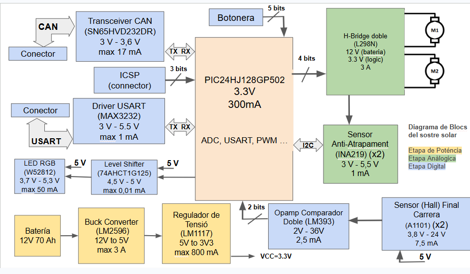

# Projecte Eines Sostre Solar 

>**Autors: Nabel Khrourouch i Marc Baillo** 
>**Versió: 0.2 **

----------

## Objectiu

Dissenyar i implementar en una PCB, un sistema electronic del vehicle com es un sostre solar. S’implementara una etapa de regulacio, microcontrolador,  bus CAN, I2C / SPI, USART i botons. 
I que incloguiu les següents caracteristiques:
- Motor del vidre amb el seu final de carrera. 
- Motor de la cortineta.
- Llums ambientals (LED RGB amb bus digital)
- Mecanisme antiatrapament (sensor digital de corrent).

## Diagrama de blocs

### Descripció/funcionalitat de cada bloc

  * Power: En aquest bloc posem la partt relacionada con 2 etapes, la de la alimentació i la de potencia. (LDO y Buck converter i el H-Bridge)
  * Microcontrolador: en aquest bloc posem les parts que tenen molt que veure amb el microcontrolador com cristal oscilador, ICSP, botonera, filtre pi, reset manual, LEDs de prova.
  * Analógica: part del sistema que és analogic i per tant la agrupem, aquí veiem el sensor de anti-atrapament.
  * Digital: part on están els components més purament digitals, como el USART, el transceiver CAN, el Sensor de Final de Carrera o LED RGB. 

-----------

## Requisits / Especificacions

  * Alimentació; 12V, regulada a 3V3
  * Microcontrolador PIC24hj128gp502
  * Motor del vidre amb el seu final de carrera. 
  * Motor de la cortineta.
  * Llums ambientals (LED RGB amb bus digital)
  * Mecanisme antiatrapament (sensor digital de corrent).

-----------

## Components

| Descripció                        | Ref                        | Package                  | Datasheet | Proveïdor | Preu (per u) | Unitats |
|----------------------------------|----------------------------|--------------------------|-----------|-----------|--------------|---------|
| Microcontrolador                | PIC24HJ128GP502           | TQFP-44                  | [Datasheet](https://ww1.microchip.com/downloads/aemDocuments/documents/OTH/ProductDocuments/DataSheets/70293G.pdf) | [Mouser](https://www.mouser.es/ProductDetail/Microchip-Technology/PIC24HJ128GP504-E-PT?qs=Fllw7YelV3%252B64KTDe2rRTg%3D%3D) | 6,85€ | 1x |
| Regulador de Tensió             | LM1117                    | SOT-223 / TO-252-3       | [Datasheet](https://www.ti.com/lit/ds/symlink/lm1117.pdf) | [Mouser](https://www.mouser.es/ProductDetail/Texas-Instruments/LM1117IMPX-3.3-NOPB?qs=X1J7HmVL2ZG7K12CpArCeA%3D%3D) | 0,89€ | 1x |
| Buck Converter (DC/DC)          | LM2596                    | TO-220-5                 | [Datasheet](https://www.onsemi.com/pdf/datasheet/lm2596-d.pdf) | [Mouser](https://www.mouser.es/ProductDetail/onsemi/LM2596DSADJG?qs=atIEnC%2F2K4W1Dy%252BFjrRjIQ%3D%3D) | 2€ | 1x |
| H-Bridge (Doble)                | L298N                     | Multiwatt-15             | [Datasheet](https://www.st.com/resource/en/datasheet/l298.pdf) | [Mouser](https://www.mouser.es/ProductDetail/STMicroelectronics/L298N?qs=gr8Zi5OG3Mj6jDtNclcF9Q%3D%3D&srsltid=AfmBOoqfHqg2YnbNWZkkZ0kC8gS-It04lRCKKxTP2hRawLswU3FHokk-) | 9,94€ | 1x |
| Transceiver CAN                 | SN65HVD232DR                 | SOIC-8                   | [Datasheet](https://www.ti.com/lit/ds/symlink/sn65hvd230.pdf?ts=1777297017115&ref_url=https%253A%252F%252Fwww.ti.com%252Fproduct%252FSN65HVD230) | [Mouser](https://eu.mouser.com/ProductDetail/Texas-Instruments/SN65HVD232DR?qs=QViXGNcIEAtY%252BrViRMr46w%3D%3D) | 1,87€  | 1x |
| Driver USART                    | MAX3232                   | SSOP-16                  | [Datasheet](https://www.mouser.es/datasheet/3/1014/1/MAX3222-MAX3241.pdf) | [Mouser](https://www.mouser.es/ProductDetail/Analog-Devices-Maxim-Integrated/MAX3232CUE%2bT?qs=CDqwynd4ZNq6sBxRCl3%2FVw%3D%3D) | 6,99€ | 1x |
| Conector                        | DE9                       | DSUB-9_Socket            | [Datasheet](https://www.te.com/commerce/DocumentDelivery/DDEController?Action=srchrtrv&DocNm=2301843&DocType=Customer+Drawing&DocLang=English&PartCntxt=2301843-1&DocFormat=pdf) | [Mouser](https://www.mouser.es/ProductDetail/TE-Connectivity-AMP/2301843-1?qs=rrS6PyfT74crws9wAQVNoA%3D%3D&mgh=1&vip=1&utm_id=19103542967&utm_source=google&utm_medium=cpc&utm_marketing_tactic=emeacorp&gad_source=1&gad_campaignid=19103548274&gbraid=0AAAAADn_wf2KTMAEN9aavrmuZXjiN2vqm&gclid=Cj0KCQjw7IjOBhDyARIsAFzrWQzWx8kAOC9-xeCib2TtXzouOFVkeyjK2X-mWbgX7vQpQhIDmcFKVOEaAr35EALw_wcB) | 1,9€ | 2x |
| Conector (Batería i Motors)                       | 282837-2                       | THT          | [Datasheet](https://www.te.com/commerce/DocumentDelivery/DDEController?Action=srchrtrv&DocNm=1-1773458-1_EURO_STYLE_QRG&DocType=Data%20Sheet&DocLang=English&PartCntxt=3-282837-2&DocFormat=pdf) | [Mouser](https://www.mouser.es/ProductDetail/TE-Connectivity/3-282837-2?qs=gdajpSf3VLdF%252BeXqJMAnlA%3D%3D&utm_id=20109199436&utm_source=google&utm_medium=cpc&utm_marketing_tactic=emeacorp&gad_source=1&gad_campaignid=20109199436&gbraid=0AAAAADn_wf3bSykfoqBB3E0CfDtWEe629&gclid=Cj0KCQjw7IjOBhDyARIsAFzrWQyU83zMWuFV4gqDL4u1LgEcrHvitAufowkzTkPBhEg_k3zvYB4tBVIaAj3AEALw_wcB) | 9,38€ | 3x |
| Sensor (corrent) Anti-Atrapament              | INA219                    | SOIC-8                      | [Datasheet](https://www.ti.com/lit/ds/symlink/ina219.pdf) | [Mouser](https://www.mouser.es/ProductDetail/) | 4,23€ | 2x |
| Sensor Final de Carrera         | A1101                     | SOT-23                   | [Datasheet](https://www.allegromicro.com/~/media/files/datasheets/a110x-datasheet.pdf) | [Mouser](https://www.mouser.es/ProductDetail/Allegro-MicroSystems/A1101EUA-T?qs=pUKx8fyJudAoca%252BrN0Sfug%3D%3D&srsltid=AfmBOopmzx3dJfmaMgARzIOmuFdzof038kPjXIFZjNx3_Dk0axwEeuXz) | 1,18€ | 2x |
| Opamp Doble Comparador        | LM393                     | SOIC-8                  | [Datasheet](https://www.ti.com/lit/ds/symlink/lm2903b.pdf?ts=1774335179874&ref_url=https%253A%252F%252Fwww.mouser.pl%252F) | [Mouser](https://www.mouser.es/ProductDetail/Texas-Instruments/LM393AP?qs=LfG3tU9ud8C8WR6rae7e8w%3D%3D&utm_id=20109199436&utm_source=google&utm_medium=cpc&utm_marketing_tactic=emeacorp&gad_source=1&gad_campaignid=20109199436&gbraid=0AAAAADn_wf3bSykfoqBB3E0CfDtWEe629&gclid=Cj0KCQjw7IjOBhDyARIsAFzrWQwk6DXPkYJ3-Ag5UdBtY40izdCAfFJImBQIx_JyaWhi5W70RpnD0e8aAgx9EALw_wcB) | 0,31 | 1x |
| Cristal Oscilador               | ECS-80-20-20BM-EN-TR      | 7mm x 5mm                | [Datasheet](https://www.mouser.es/datasheet/3/294/1/csm_8mr.pdf) | [Mouser](https://www.mouser.es/ProductDetail/ECS/ECS-80-20-20BM-EN-TR?qs=3Rah4i%252BhyCEvSjMjFbrNOA%3D%3D&utm_id=9882080341&utm_source=google&utm_medium=cpc&utm_marketing_tactic=emeacorp&gad_source=1&gad_campaignid=9882080341&gbraid=0AAAAADn_wf2VPwruzVVuU5TdtfDNM-71c&gclid=CjwKCAjwpcTNBhA5EiwAdO1S9kbEmbKF8UUMwaVP0zWJXkCwjEh6ns86OOaH_PQxj7KPIVRFoQ-tjhoCMYIQAvD_BwE) | 0,86€ | 1x |
| Ferrita                         | BLM21                     | 0805                     | [Datasheet](https://www.mouser.es/datasheet/3/76/1/ENFA0005.pdf) | [Mouser](https://www.mouser.es/ProductDetail/Murata-Electronics/BLM21PG600SN1D?qs=LbqjZSvnDswFXSg06XQ50A%3D%3D&utm_id=9882080341&utm_source=google&utm_medium=cpc&utm_marketing_tactic=emeacorp&gad_source=1&gad_campaignid=9882080341&gbraid=0AAAAADn_wf2r1gIBG4HB31JwCLchDktw_&gclid=Cj0KCQjw9-PNBhDfARIsABHN6-1kCnzr_LU1mZd8ISSiD6a4Y2yPfWM2slAP8zejLYN4QiWVlEgd_j4aAjKhEALw_wcB) | 0,10€ | 1x |
| Switch (Pulsador) Reset y Botonera                 | B3F-1002                  | THT                      | [Datasheet](https://www.mouser.es/datasheet/3/39/1/en_b3f.pdf) | [Mouser](https://www.mouser.es/ProductDetail/Omron-Electronics/B3F-1002?qs=lK7M36XCk6Jk6Tf1a0ilbA%3D%3D&mgh=1&vip=1&utm_source=chatgpt.com) | 0,27€ | 6x |
| LED blau                        | LTST-C170TBKT             | LED_SMD                     | [Datasheet](https://www.mouser.com/catalog/specsheets/Lite-On-LTST-C170TBKT.pdf) | [Mouser](https://www.mouser.es/ProductDetail/LITEON/LTST-C170TBKT?qs=0uL0gcxEMop2ooGmIUzw3A%3D%3D&mgh=1&vip=1&utm_source=chatgpt.com) | 0,23€ | 1x |
| LED vermell                     | LTST-C170KRKT             | LED_SMD                     | [Datasheet](https://www.mouser.com/catalog/specsheets/Lite-On-LTST-C170KRKT.pdf) | [Mouser](https://www.mouser.es/ProductDetail/LITEON/LTST-C170KRKT?qs=NUb82WqeCyrVOID%2Fxt4rgA%3D%3D&utm_id=9882080341&utm_source=google&utm_medium=cpc&utm_marketing_tactic=emeacorp&gad_source=1&gad_campaignid=9882080341&gbraid=0AAAAADn_wf35b0MW3nfCvSzMlg6XwcaGU&gclid=CjwKCAjwyYPOBhBxEiwAgpT8P6xYGFYLA1kJHVwio65sFBFYBpuG5qPQD4Bkm8pgxI7bRmXtEGCxWBoC7pMQAvD_BwE) | 0,14€ | 1x |
| LED RGB                         | WS2812                    | LED_SMD                 | [Datasheet](https://www.tme.eu/Document/01c0100fee68667af99767edc3a7fee2/WS2812B-MINI.pdf) | [TME](https://www.tme.eu/es/details/ws2812b-mini/leds-smd-de-colores/worldsemi/?utm_source=google&utm_medium=cpc&utm_campaign=HISZPANIA%20%5BDSA%5D&utm_content=&campaign_id=18880888776&gad_source=1&gad_campaignid=18880888776&gbraid=0AAAAADyylhLJURluAY7jUeNc8-F-2bfAx&gclid=Cj0KCQjw7IjOBhDyARIsAFzrWQzO_PW3O0VVMhyARWr_1LRVY-vRQsT44Hck0vcMLTjOFT9BO_EXdCEaAkMFEALw_wcB) | 0,42€ | 1x |
| Level shifter (buffer)                        | 74AHCT1G125            | SOT-553              | [Datasheet](https://www.ti.com/lit/ds/symlink/sn74ahct1g125.pdf?ts=1774340206599&ref_url=https%253A%252F%252Fwww.mouser.dk%252F) | [Mouser](https://www.mouser.es/ProductDetail/Texas-Instruments/74AHCT1G125DBVTG4?qs=AsTZqt%2FmeqnddshDG5FV%2Fw%3D%3D&utm_id=20109199436&utm_source=google&utm_medium=cpc&utm_marketing_tactic=emeacorp&gad_source=1&gad_campaignid=20109199436&gbraid=0AAAAADn_wf3bSykfoqBB3E0CfDtWEe629&gclid=Cj0KCQjw7IjOBhDyARIsAFzrWQxSsxXdPjF95Q5vX5TJ7WjE_NFE_Jxv0JufhHPBQC8U8gs4R3YIGEkaAvcBEALw_wcB) | 0,93€ | 1x |

-----------

## Historial de canvis

| Data     | Autor         | Branch | Versió   | Descripció                                                                 |
|----------|--------------|--------|----------|----------------------------------------------------------------------------|
| 10/03/26 | Nabel i Marc | Master | versió 1 | Seleccionem els components i creem la primera versió del Diagrama de Bloc |
| 14/03/26 | Nabel        | Master | versió 2 | Actualització del Diagrama de Bloc                                        |
| 16/03/26 | Marc         | Master | versió 1 | Esquemàtic: creació dels subapartats del projecte                         |
| 17/03/26 | Marc         | Master | versió 2 | Esquemàtic: faig la part del uC i de Digital                              |
| 17/03/26 | Nabel        | Master | versió 3 | Esquemàtic: faig la part de power i analògica                             |
| 22/03/26 | Marc         | Master | versió 4 | Esquemàtic: correcció d’errades i assignació de footprints                |
| 24/03/26 | Nabel        | Master | versió 1 | Layout: faig el rutejat de la majoria dels components                     |
| 24/03/26 | Marc         | Master | versió 2 | Layout: corregeixo algunes coses    					|
| 30/03/26 | Nabel         | Master | versió 3 | Layout: rutejat part Digital    |
| 31/03/26 | Marc         | Master | versió 4 | Layout: treballo part potencia, H_Bridge    |
| 08/04/26 | Marc i Nabel        | Master | versió 5 | Layout: treballem a clase i l'intentem possar a punt |
 | 15/04/26 | Marc i Nabel        | Master | versió 6 | Layout: corregim algunes coses com tema de plans i posar plans de massa digitla y power |  27/04/26 | Nabel         | Master | versió 1 | Faig el pressupost |  								| 28/04/26 | Marc      | Master | versió 7 | Layout: acabo el Layout posant uns canvis proposat pel profesor

  